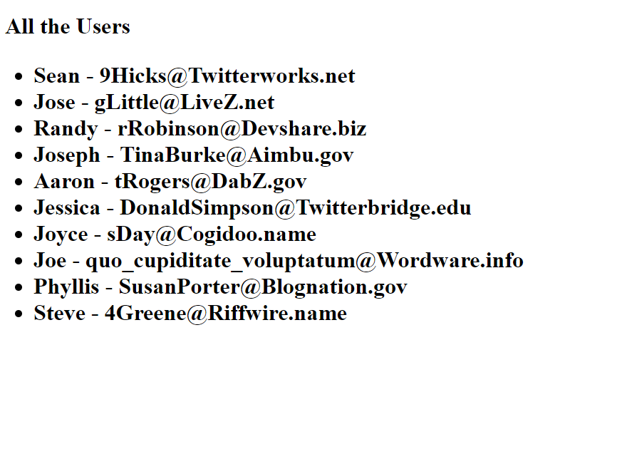

# Access CosmosDB from Azure Container Instances Using Manged Identites

This example walks through how to get and display a list a users from a CosmosDB Mongo database. But no more passing secrets or credentials to your application. We're going to be using Managed Identites for Azure Resources instead. This is going to allow us to securly get all of the secrets we want (in this case a cosmosDB connection string) from an Azure Key Vault.

Our final output should be a webpage that looks something like this:



It's not the prettiest but should show just how powerful Azure Container Instances with Managed Identities can be.

## Prerequisites

- An Azure subscription. Get a [free trial here](https://azure.microsoft.com/en-us/free/)!

- A [DockerHub](http://dockerhub.com) or other container registry account.

- A machine with Docker installed

## Getting Started

### Build and Push the Image

First up is to build and push our container to a container registry e.g. Dockerhub, Azure Container Registry

1. On a machine with docker installed, run the following command in this directory with the Dockerfile to build the container image

```sh
    docker build -t <dockerhub-username>/msi-cosmosdb:0.0.1 .
```

The above command will install all the dependencies into the container. The first time you run this is will take a while to download all of the dependencies but will be much faster once it is cached.

2. Push the image to [DockerHub](http://dockerhub.com)

```sh
    docker push <dockerhub-username>/msi-cosmosdb:0.0.1
```

### Setting Up the Azure Resources

To deploy the container, open either a terminal with the Azure CLI installed or check out [CloudShell](https://shell.azure.com/) for a ready-to-go option

First, lets set up some environment variables to make these commands nicer to copy and paste

```sh
DOCKER_IMAGE_NAME="<imageName>" #This is the image name you pushed to dockerhub
RESOURCE_GROUP="<myResourceGroup>" #If this doesn't exist we will create one
COMOSDB_ACCOUNT_NAME="<my-cosmosdb-account-name>" #This must be all lowercase
KEYVAULT_NAME="<mykeyvault>"
USER_ASSIGNED_IDENTITY_NAME="<myUserAssignedIdenity>"
```

Create a resource group.

    az group create --name $RESOURCE_GROUP --location westus

#### Create a CosmosDB Mongo Database

Create a CosmosDB with the MongoDB API. Make sure the name is all lowercase

    az cosmosdb create -g $RESOURCE_GROUP --name $COMOSDB_ACCOUNT_NAME --kind MongoDB

The above command will take a few minutes to finish creating the database.

THe following command will get the secret connection string and remove the ssl=true which is required for our mongo golang driver

    CONNECTION_STRING=$(az cosmosdb list-connection-strings -g $RESOURCE_GROUP -n $COMOSDB_ACCOUNT_NAME --query connectionStrings[0].connectionString |sed -e "s/\/?ssl=true//")

#### Create the User Assigned Identity

Next we create a user assigned identity. Once we create and add the permissions, we will be able to use this for multiple container groups.

The following commands will create the identity and get the needed information from it.

    CLIENT_ID=$(az identity create -g $RESOURCE_GROUP --name $USER_ASSIGNED_IDENTITY_NAME --query clientId | tr -d '"')
    PRINCIPAL_ID=$(az identity show -g $RESOURCE_GROUP --name $USER_ASSIGNED_IDENTITY_NAME --query principalId | tr -d '"')
    MSI_RESOURCE_ID=$(az identity show -g $RESOURCE_GROUP --name $USER_ASSIGNED_IDENTITY_NAME --query id | tr -d '"')

#### Create a Key Vault and Set the Permissions

If you don’t already have a Key Vault create, use the following command to create one:

    az keyvault create -g $RESOURCE_GROUP --name $KEYVAULT_NAME

Now we can add our connection string we got earlier as a secret in KeyVault

    az keyvault secret set --name cosmosDBConnectionString --value $CONNECTION_STRING --vault-name $KEYVAULT_NAME

Now, we can give our identity access to the Key Vault

    az keyvault set-policy -n $KEYVAULT_NAME --object-id $PRINCIPAL_ID -g $RESOURCE_GROUP --secret-permissions get

The above command uses the environment variable we set to give our identity “get” permission for secrets in the Key Vault

### Time to Deploy to Azure Container Instances

Now we can use the single deploy command for ACI, make sure to change to the correct image name below:

```sh
az container create \
    --resource-group $RESOURCE_GROUP \
    --name msi-cosmosdb \
    --ip-address public \
    -e VAULT_NAME=$KEYVAULT_NAME MSI_CLIENTID=$CLIENT_ID \
    --image $DOCKER_IMAGE_NAME \
    --assign-identity $MSI_RESOURCE_ID \
    --query ipAddress.ip
```

The above command will create the container instance and set up everything needed for Managed Identities. 

Once the command has finished, you should see the public IP Address for the container group. Go to the address and you should see something that looks like the following: 


That should be a good start to never needing to store production credentials again.

## Issues

If you have any issues or find any mistakes, Please open an Issue on this repository and we will update this document.
